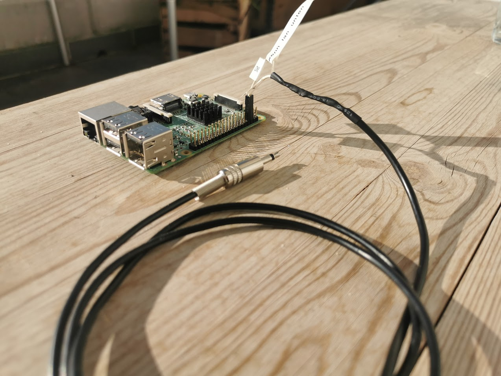

# Objective 
Port of arduino library [docbender/Onkyo-RI](https://github.com/docbender/Onkyo-RI) to rasperry pi platform. Enables you to remote control most Onkyo devices. 


# Make your own RI -> GPIO cable
You need to **bulild a cable** youslelf with a **3.5mm mono jack**, that has a **10kOhms resistor** in parallell, and connect the other end to a Rasperry Pi's GPIOS (There's a klicki bunti Guide for that)

# Getting started


If you are trying to intigrate this into **NodeRed** go this way [node-red-contrib-onkyo-ri](https://flows.nodered.org/node/node-red-contrib-onkyo-ri) It ships this library and installs it automatically! 


# Installation

```
git clone https://github.com/dajuly20/Onkyo-RI-Rasperrypi
cd Onkyo-RI-Rasperrypi
./onkyoricli -p <wiringPi pin#> -c 0x20[,0x30]
```

The binary should run on everything thats not too far from [Raspberry Pi OS](https://www.raspberrypi.com/software/) 
Build on **Rasperry Pi 4 running 32 Bit Raspian**


Otherwise you will need to build it yourself.

## Prerequisits 

```
sudo apt update && sudo apt upgrade && sudo apt install -y build-essential gcc g++ make wiringpi
```


If there is no package for wiringpi, build it yourself too:
```
git clone https://github.com/wiringpi/wiringpi
cd wiringPi
git pull origin
./build
cd ..
```

Now we are ready to build the actual thing
```
git clone https://github.com/dajuly20/Onkyo-RI-Rasperrypi
cd Onkyo-RI-Rasperrypi
rm onkyoricli
/build
/onkyoricli -p <wiringPi pin#> -c 0x20[,0x30]
```

You need a cable like that: 
* [3,5 mm Mono Klinkenkabel Verlängerung - 5m ](https://amzn.to/3Srv8tw) *(Amazon affiliate)*
* Cut off the end
* Solder a 10kOhms [resistor](https://amzn.to/3WEStKB) between the lines (I put it in the connector)
* Find the right WiringPi `pinout`


To connect to the RI port a 3.5mm mono jack is used. Tip is for data signal and sleeve is ground (GND). In case of stereo jack, connect tip to DATA, sleeve **and** ring to GND. That means for a Rasperry Pi 3 to put the tip to Pin 22 (GPIO_GEN6) GPIO25 (tx) (which is set as Standart for this node) and the shield to Pin 20 or another ground (Gnd). Please note, the pins can't be connected to UART ( Pin 8 / 9 ). (I didn't try it, so correct me if im worng).
If you want to use another GPIO, you can specify that later in node red. The connection schema shown below is for a Rasperry Pi 3. 
If you have Wiring Pi installed you can use ```gpio readall``` 

```
 Receiver for "Onkyo's RI Interface" (to RS-232, lirc_serial)
                 
 RI phone jack  +----+------------o DCD
 (mono, 3.5mm) /     |
          ____/     | | R1 (10k)
         /   /     | |
        (  ()  )     |
         ____/------+------------o GND
 
 brand: Onkyo Remote Interactive
 model no. of "remote control": TX-SR502E
 devices being controlled by this remote:
 "Onkyo RI" connected devices (via Onkyo Remote Interactive cable)
 (DVD, MD, CD, TAPE, CDR)
egin remote
 name  Onkyo_TX-SR502E
 bits           12
  flags SPACE_ENC|CONST_LENGTH
  eps            30
  aeps          100

  header       3000  1000
  one          1000  2000
  zero         1000  1000
  ptrail       1000
  gap          67000
  toggle_bit      0

  frequency    38000
  duty_cycle   100
```
## Wiring stuff up 
To connect to the RI port a 3.5mm mono jack is used. Tip is for data signal and sleeve is ground (GND). In case of stereo jack, connect tip to DATA, sleeve **and** ring to GND. That means for a Rasperry Pi 3 to put the tip to Pin 22 (GPIO_GEN6) GPIO25 (tx) (which is set as Standart for this node) and the shield to Pin 20 or another ground (Gnd). Please note, the pins can't be connected to UART ( Pin 8 / 9 ). (I didn't try it, so correct me if im worng).
If you want to use another GPIO, you can specify that later in node red. The connection schema shown below is for a Rasperry Pi 3. 
If you have Wiring Pi installed you can use ```gpio readall``` 


If you connected the cable as suggested below use ```25```
If you have another model then look for WiringPi pin numbers rasperry pi xxx. 



This is the cable I made. The part close to the pi contains my 10k resistor, which my past-me seemed to have soldered in correctly - yet it seemed to work. (In the picture it is connected to UART Pins - which is wrong as I guess. 8 =>  22 ( GPIO25 ) and ground could make its shorter path 6 => 20.


http://fredboboss.free.fr/articles/onkyo_ri.php

# Codes

### For Onkyo TX-SR606 receiver 
 Most models have similar codes... you can just try out if they work or look at these beautiful other  `Readme` 's 

  * [docbender/Onyko-RI](https://github.com/docbender/Onkyo-RI) Library for Arduino platform.
* [ahaack/onkyo-rpi](https://github.com/ahaack/onkyo-rpi) `python main.py --gpio 25 0x1AE`  Using the python implementation.

* [ahaack/onkyo-rp](https://github.com/ahaack/onkyo-rpi/edit/master/README.md#scan-for-supported-messages) `python scan.py --lower 0x120 --upper 0x12F` Using the scan function. 
. 
<table>
  <tr><td><b>Action</b></td><td><b>Command</b></td><td><b>Notes</b></td></tr>
  <tr><td>Input CD</td><td>0x20</td><td>Switch input to CD channel</td></tr>
  <tr><td>Turn On + CD</td><td>0x2F</td><td>Turn ON receiver and select CD as input channel</td></tr>
  <tr><td>Input TAPE</td><td>0x70</td><td>Switch input to TAPE channel</td></tr>
  <tr><td>Turn On + TAPE</td><td>0x7F</td><td>Turn ON receiver and select TAPE as input channel</td></tr>  
  <tr><td>Input DVD</td><td>0x120</td><td>Switch input to DVD channel</td></tr>
  <tr><td>Turn On + DVD</td><td>0x12F</td><td>Turn ON receiver and select DVD as input channel</td></tr>
  <tr><td>Input GAME/TV</td><td>0x1A0</td><td>Switch input to GAME/TV channel</td></tr>
  <tr><td>Vol Up</td><td>0x1A2</td><td>Volume Up (only when input is set to GAME/TV)</td></tr>
  <tr><td>Vol Down</td><td>0x1A3</td><td>Volume Down (only when input is set to GAME/TV)</td></tr>
  <tr><td>Mute</td><td>0x1A4</td><td>Mute (only when input is set to GAME/TV)</td></tr>
  <tr><td>Unmute</td><td>0x1A5</td><td>Unmute (only when input is set to GAME/TV)</td></tr>
  <tr><td>Power Off</td><td>0x1AE</td><td>Power OFF (only when input is set to GAME/TV)</td></tr>
  <tr><td>Turn On + GAME/TV</td><td>0x1AF</td><td>Turn ON receiver and select GAME/TV as input channel</td></tr>
  <tr><td>Setup</td><td>0x420-0x424</td><td>Displayed: SETUP. Playing loud noisy sounds</td></tr>
  <tr><td>CEC test</td><td>0x43E</td><td>Displayed: CEC TEST OK</td></tr>
  <tr><td>TEST 5-00</td><td>0x43F</td><td>Displayed: TEST 5-00</td></tr>
</table>

# If you don't have luck

Use the pythong scan script to go through every possible combination and wait patiently for your Onkyo hardware to do something ;-) 


## Further reading 

## Protocol
Protocol description could be found at:

*    http://lirc.sourceforge.net/remotes/onkyo/Remote_Interactive

or with grafical representation at:
*    http://fredboboss.free.fr/articles/onkyo_ri.php .

#### Notes on volume (as per [ahaack/onkyo-rpi](https://github.com/ahaack/onkyo-rpi))
Volume control codes shown in the table are sent by the receiver out of its RI ports when adjusting the volume using a remote control (they can be found using an oscilloscope).
However, the receiver will not react to these codes when they are sent from an external device, effectively making impossible to control its volume through RI signals.

**Comment to that by Julian Wiche**:

That doesn't seem to be true on every device. I **could** contol the volume on my TX SR 605 when input is set to Game/TV. 
The scan program (see further up) can be used to obtain the codes - it only requires a "bit" of parience. I think that receivers, that have a motor to turn the knob won't work. 

## Test program
If none of the abouve codes works for you. You can walk through any possible code with the test program. See: [ahaack/onkyo-RPI](https://github.com/ahaack/onkyo-RPI) 
It serves for check all codes (0x000 - 0xFFF) on the target device in a 500ms interval. 

NOTE: As per my personal experience: For me testing went thought a testing mode, that made a loud sinus tone.. also it could increase the volume before.. so be careful not to wake anyone when you try this at nights :D 

## Feel free to Contribute 
If it's just Ri Codes for your Hardware by sending a merge request or write me an email. 
if you fork the whole thing and make it your own project. Please share your findings! Before you fork though, you can send me a message - I 've seen it often enough to have the same project in 100 different forks / versions on npm / Node Red. Think of DAUs. They won't know which version to install.  

## Known Issues 
* WiringPi is kind of outdated... sould go to other lib asap
